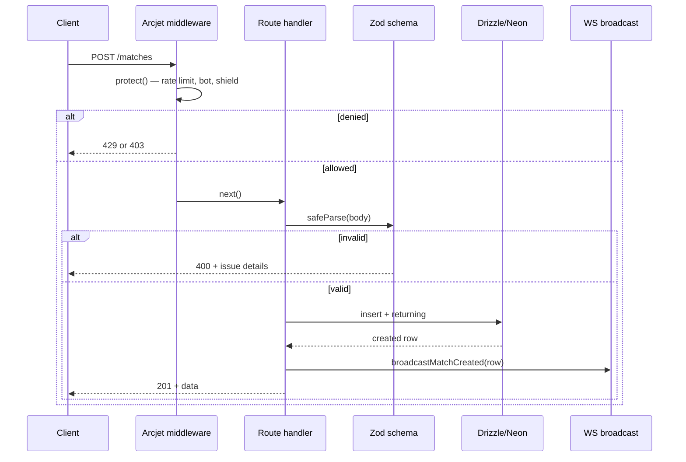

The backend (`sportz`) is a single Node process. It is intentionally a **monolith** — REST and WebSocket in one deployable — because at current scale that is simpler and cheaper than splitting, and splitting too early is a classic over-engineering trap (see [Project Status](/project-status)).

## Folder structure

```
src/
├── app.ts              # createApp() — builds Express WITHOUT listening
├── index.ts            # entry point — creates server, attaches WS, listens
├── arcjet.ts           # security middleware + WS protection instances
├── db/
│   ├── db.ts           # pg Pool + Drizzle client + SSL strategy
│   └── schema.ts       # matches + commentary tables
├── routes/
│   ├── matches.ts      # GET/POST /matches
│   └── commentary.ts   # GET/POST /matches/:id/commentary
├── validation/
│   ├── matches.ts      # Zod schemas + MATCH_STATUS constant
│   └── commentary.ts   # Zod schemas
├── utils/
│   ├── logger.ts       # Winston (console in prod, files in dev)
│   └── match-status.ts # derive scheduled/live/finished from timestamps
└── ws/
    └── server.ts       # WebSocket server, subscription registry, broadcast API
```

### Why `app.ts` is separate from `index.ts`

`createApp()` builds the Express app but does **not** call `listen()`. `index.ts` imports it, creates the HTTP server, attaches the WebSocket layer, and only then listens.

This split exists for **testability**. Supertest drives an Express app object directly, in-memory, without binding a port. If app construction and `server.listen()` lived in the same file, importing it from a test would start a real server as a side effect — and two test files would fight over the port. Separating "build the app" from "run the app" is what makes the entire route layer testable. (This was a real refactor — see [Issues](/issues).)

## Request lifecycle



Note the order: **security first, then validation, then persistence, then broadcast.** A request that fails Arcjet never touches Zod; one that fails Zod never touches the database. Each layer is a gate.

## The database layer and its SSL strategy

`db.ts` connects via a `pg` Pool wrapped by Drizzle. The non-obvious part is SSL, which has **three** distinct cases — a subtlety that caused a real bug ([Issues](/issues)):

```ts
const sslEnabled = process.env.DATABASE_SSL !== 'false';
const rejectUnauthorized = process.env.DATABASE_SSL_REJECT_UNAUTHORIZED !== 'false';

export const pool = new Pool({
  connectionString: process.env.DATABASE_URL,
  ssl: sslEnabled ? { rejectUnauthorized } : false,
});
```

| Environment | `DATABASE_SSL` | `rejectUnauthorized` | Why |
|---|---|---|---|
| Neon Cloud (prod) | unset → on | true | Valid certs; verify them. |
| Neon Local (dev) | unset → on | `false` | Self-signed cert; attempt SSL but skip verification. |
| Plain Postgres (test/CI) | `false` → off | n/a | No SSL configured at all; passing *any* `ssl` object makes `pg` attempt a handshake the server refuses. |

The trap: `{ rejectUnauthorized: false }` still *attempts* SSL. Turning SSL off entirely requires `ssl: false`. Those look similar and behave completely differently.

## Failure modes

| Failure | Current behavior | Honest assessment |
|---|---|---|
| DB unreachable | Route's `try/catch` → `500` | Correct, but no retry/circuit-breaker. Fine at this scale. |
| Invalid input | Zod → `400` with issue details | Good. |
| Arcjet itself errors | Caught → `503` | Fails closed (denies) on the HTTP path. |
| Commentary for non-existent match | FK violation → generic `500` | **Known gap** — should be `404`. Documented in [Issues](/issues); a test pins the current behavior so a fix is deliberate. |
| Process receives SIGTERM | Exits immediately | **No graceful shutdown yet.** WS connections drop uncleanly. `attachWebSocketServer` now returns `close()`, which is the building block for a future SIGTERM handler. |
