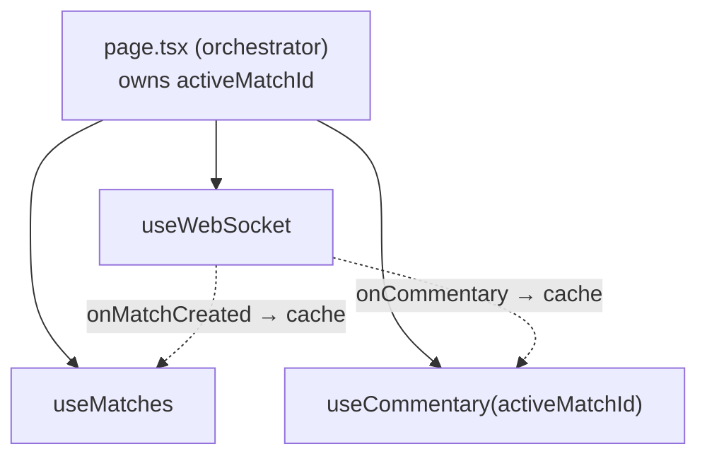

The frontend (`sportz-ui`) is a **Next.js App Router** application. Despite using the App Router, nearly every component is a **client component** (`'use client'`) — because the app is fundamentally interactive and WebSocket-driven. Server components and streaming, which shine for content sites, would fight a real-time model where the client holds a live socket and mutates state continuously. That is a deliberate choice, not an oversight.

## Folder structure

```
src/
├── app/
│   ├── layout.tsx      # providers nest here (Theme → Query → PostHog → NewRelic)
│   ├── page.tsx        # the orchestrator — owns activeMatchId, wires hooks
│   └── globals.css     # design tokens (brand yellow, dark theme, animations)
├── components/
│   ├── layout/Header.tsx
│   ├── matches/        # MatchCard, MatchGrid, ScoreBox, LiveIndicator, SportBadge, skeleton
│   ├── commentary/     # CommentaryPanel, CommentaryEvent, EventTypeBadge
│   └── ui/             # SportzButton, Pagination, StatusBadge, modals, EmptyState
├── hooks/
│   ├── useWebSocket.ts # connect, reconnect (exponential backoff), subscribe
│   ├── useMatches.ts   # React Query + client-side pagination
│   └── useCommentary.ts# React Query, enabled only when a match is selected
├── lib/
│   ├── types.ts        # shared types mirroring the backend schema
│   └── constants.ts    # env-aware API_URL / WS_URL, event colors
└── providers/          # ThemeProvider, QueryProvider, PostHog, NewRelic
```

## Data fetching strategy — React Query

REST data (matches, commentary) is fetched and cached by **TanStack Query**. The key design decision is that **WebSocket events write directly into the React Query cache** rather than into separate state:

```ts
// when a WS commentary event arrives, prepend it to the cached query
queryClient.setQueryData(['commentary', matchId], old => ({
  data: [event, ...(old?.data ?? [])],
}));
```

This means there is **one source of truth** for commentary — the `['commentary', matchId]` cache entry — fed by both the initial REST fetch and live WS events. No reconciliation between "fetched data" and "live data." See the [React Query ADR](/decisions).

### Pagination — client-side over a fetched window

Matches are fetched **all at once** (`GET /matches?limit=100`) and paginated **in the browser** (`MATCHES_PER_PAGE = 6`). This is deliberate: WebSocket events add matches at runtime, and with client-side pagination a `match_created` written to the cache via `setQueryData` **appears immediately** on page 1 — server-side pagination would need a refetch for a live-added match to show. Commentary similarly fetches a recent window (`limit=50`), matching the demo's prune cap.

**Live matches sort to the top.** The displayed list is derived with a stable `compareLiveFirst` sort (over a *copy* — sorting the cache array in place would mutate shared state during render), so live matches lead and, within each group, newest-first order is preserved.

**The client cache is bounded, mirroring the backend's pruning.** This is a cache-consistency subtlety: with incremental `setQueryData` updates, `match_created` events **append forever** while the backend prunes its DB — so the client's copy drifts and grows until a refetch. The fix is to bound the cache write (`trimMatches`, cap `MATCHES_CACHE_LIMIT`) the way the server bounds its data: **keep all live matches + the one being watched, then the newest finished up to the cap.** Keeping the watched match matters — otherwise a match could be trimmed out from under the open commentary panel. The general lesson: **an incrementally-updated cache must handle *removals*, not just additions, or it diverges from the source of truth** (the alternative being to `invalidateQueries` and refetch, trading "instant" for "always consistent").

<Warning>
**Known limitation:** there is no "next 100." The app loads the **100 most-recent** matches and paginates *those* client-side; matches beyond 100 are never fetched. The backend route accepts only `limit` (no `offset`/cursor), so it always returns the same top window. Fine at demo scale (the simulator prunes finished matches to ~8, so the total stays well under 100). Scaling past 100 would need **cursor (keyset) pagination** — `?after=<createdAt|id>` with `WHERE createdAt < :cursor` — which stays stable as new rows are inserted at the top (offset pagination would *drift* in a real-time feed). Not built.
</Warning>

## State management strategy

| State | Where it lives | Why |
|---|---|---|
| Server data (matches, commentary) | React Query cache | Caching, dedup, loading/error states for free |
| `activeMatchId` (which match is being watched) | `useState` in `page.tsx` | Shared across grid, panel, and WS — the orchestrator owns it |
| WS connection status | `useState` in `useWebSocket` | Drives the connection badge |
| Theme | `next-themes` | Persists to localStorage, resolves system preference |

There is **no Zustand/Redux.** A single page with one shared pivot (`activeMatchId`) doesn't need a global store; `page.tsx` as orchestrator is sufficient. If routing/multi-page shared state arrives, the next step is a `useSportzApp()` custom hook, then a store — in that order.

## The orchestrator pattern

`page.tsx` owns the hooks and wires them together, because they depend on each other through shared state:



## Design system

Tokens live in `globals.css` as CSS variables, themed for light and dark. The rule enforced throughout: **components reference tokens, never raw hex.** One edit to a variable repaints the whole UI.

- **Brand yellow** `#F4C542` (chosen over a more saturated original to reduce eye-fatigue over long match sessions)
- **Semantic event colors** — every event type across all five sports maps to a meaning-based color (scoring green/emerald, cautions amber, severe red, neutral grey), so commentary types are distinguishable at a glance, not all yellow.
- **Per-sport tags** — each match card's sport pill has its own icon + accent (⚽ football, 🏀 basketball, 🏏 cricket, 🎾 tennis, 🏉 rugby), so sports don't blur together in the grid.

## Animation strategy

Framer Motion, with one hard rule: **only animate `transform` and `opacity`** (GPU-composited), never layout properties. Continuous animations (the live pulse) use CSS, not JS, to avoid holding a `requestAnimationFrame` loop for the whole session. `useReducedMotion` disables motion for users who request it. See the [Framer Motion ADR](/decisions) and the animation performance entry in [Issues](/issues).

One event-driven flourish: a **score celebration** — when the score of the match you're watching goes **up**, the sport's ball (⚽🏀🏏🎾🏉) bursts across the screen (~1s, `pointer-events-none`, off under reduced motion). It triggers on the *score increase* (not on an event-type list), so it works for every sport with no maintained set.
