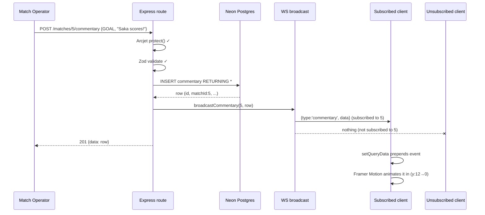

This is the heart of Sportz. Everything else exists to serve this path: an event happens, and within sub-second latency every watching client sees it.

## The WebSocket protocol

Clients connect to `/ws` and speak a tiny JSON protocol:

| Direction | Message | Meaning |
|---|---|---|
| Server → Client | `{ type: 'welcome' }` | Sent on connect |
| Client → Server | `{ type: 'subscribe', matchId }` | Join a match's room |
| Server → Client | `{ type: 'subscribed', matchId }` | Confirmation |
| Client → Server | `{ type: 'unsubscribe', matchId }` | Leave a room |
| Server → Client | `{ type: 'match_created', data }` | Broadcast to **all** clients |
| Server → Client | `{ type: 'score_update', data }` | Broadcast to **all** clients |
| Server → Client | `{ type: 'commentary', data }` | Broadcast to **subscribers of that match only** |
| Server → Client | `{ type: 'error', message }` | Malformed input |

The distinction matters: `match_created` and `score_update` are **global** — a new match and a changed scoreline both show on the match card in *everyone's* grid, so every client needs them. `commentary` is **room-scoped** — only people watching match 5 care about its ball-by-ball. Getting this wrong either way is a bug: room-scoping a score would leave other viewers' cards stale; broadcasting all commentary to everyone would waste bandwidth and leak unrelated matches.

## The subscription registry

The server keeps an in-memory map of `matchId → Set<socket>`:

```ts
const matchSubscribers = new Map<number, Set<SportzSocket>>();
```

Each connected socket also tracks its own subscriptions, so that when it disconnects, cleanup removes it from every room it joined. This is the data structure that makes room-scoped broadcast O(subscribers) instead of O(all clients).

## Story: a goal is scored

Walk the full path, end to end:



1. **Event enters** — operator POSTs to the commentary endpoint.
2. **Validation** — Arcjet gate, then Zod (`sequence`, `eventType`, `message` required).
3. **Storage** — Drizzle insert returns the created row with its DB-assigned `id` and `createdAt`.
4. **Broadcast** — the route calls `broadcastCommentary(5, row)`; the WS layer looks up room `5` and sends only to those sockets.
5. **Client receives** — the subscribed client's `onmessage` fires; `useWebSocket` routes it to `onCommentary`, which calls `addEvent`, which does `setQueryData` to prepend it to the cached commentary list.
6. **UI updates** — the new `CommentaryEvent` enters with a `y: 12 → 0` fade (marked as "new" so only it animates, not the whole list).

## Client resilience — reconnection

Networks drop. `useWebSocket` handles it with **exponential backoff**:

```
attempt 1 → wait 2s
attempt 2 → wait 4s
attempt 3 → wait 8s  …capped at 30s
after 10 attempts → give up, status = 'disconnected'
```

On the UI, the connection badge reflects `connecting / connected / reconnecting / disconnected` with distinct colors, and an error modal appears on full disconnect. When the socket recovers, the badge returns to green and a PostHog `ws_reconnected` event fires (so you can later correlate instability with engagement).

## Heartbeat — killing ghost connections

A client can vanish without a clean close (laptop sleeps, network dies). The server pings every 30s and terminates any socket that didn't pong since the last round:

```ts
const interval = setInterval(() => {
  wss.clients.forEach((socket) => {
    if (!socket.isAlive) return socket.terminate();
    socket.isAlive = false;
    socket.ping();
  });
}, 30000);
```

This interval is cleared by `close()` — which matters for tests (a dangling 30s timer keeps the test process alive) and for a future graceful shutdown. The need for `close()` was discovered while writing the WebSocket tests; see [Issues](/issues).

## Known limitation at scale

Sportz **already implements a pub/sub _pattern_**: clients subscribe to match rooms and the server publishes events to that room's subscribers (`subscribe` / `unsubscribe` / `broadcastToMatch` over the `matchSubscribers` map). That is textbook publish/subscribe — topics are match IDs, subscribers are sockets.

The limitation is that this pub/sub is **in-process**: the `matchSubscribers` map lives in one Node process's memory. The moment you run a second API instance, a client connected to instance A will not receive an event created on instance B — because B's broadcast only reaches B's local map.

Scaling past one instance therefore means **lifting the existing in-process pub/sub onto a distributed backbone** (e.g. Redis pub/sub, NATS, or Postgres `LISTEN/NOTIFY`): each instance publishes broadcasts to a shared channel, and every instance relays from that channel to its own local subscribers. This is documented as the first infrastructure addition in [System Architecture](/architecture/system) — and is correctly **not** built yet, because at a single instance the in-process version is the right, simplest choice.
