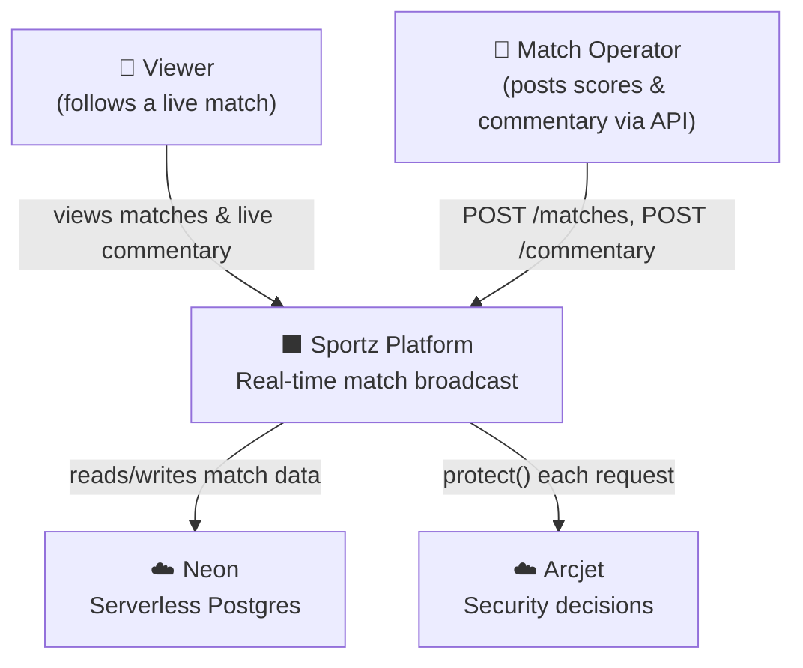
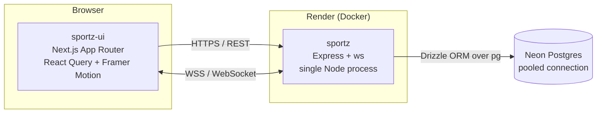
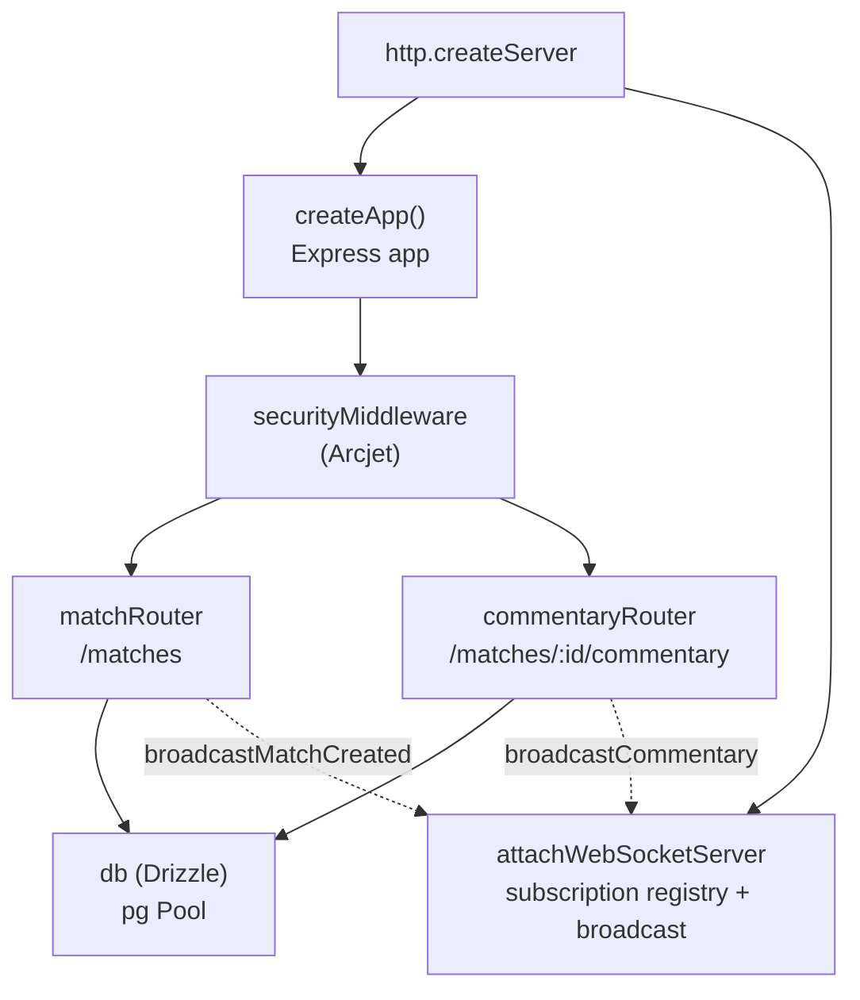

We describe the architecture using the [C4 model](https://c4model.com/): four levels of zoom, from "who uses it" down to "what the code does." Each level answers a different question for a different reader.

## Level 1 — System Context

*Who and what interacts with Sportz?*



There is no authentication layer — the "operator" is anyone with API access. That is a deliberate scope decision for a demo platform; see [Project Status](/project-status).

## Level 2 — Containers

*What are the deployable units, and how do they talk?*



The single most important structural fact: **REST and WebSocket share one HTTP server.** Express handles normal requests; an `upgrade` listener intercepts `/ws` connections before they reach Express and hands them to the `ws` server. One process, one port, one deployable container.

## Level 3 — Components (Backend)

*Inside the `sportz` container, what are the pieces?*



The broadcast functions are created inside `attachWebSocketServer()` and injected onto `app.locals`, so the REST routes can trigger a WebSocket broadcast without importing the WS module directly. This is the seam that connects "data was written" to "tell the clients."

## Level 4 — Code

*The seam, in actual code.* When a commentary event is posted:

```ts
// routes/commentary.ts — after a successful insert
const [event] = await db.insert(commentary).values({ ...body, matchId }).returning();

if (res.app.locals.broadcastCommentary) {
  res.app.locals.broadcastCommentary(matchId, event);  // ← REST triggers WS
}
res.status(201).json({ data: event });
```

```ts
// ws/server.ts — broadcast only to clients subscribed to this match
function broadcastToMatch(matchId: number, payload: WsPayload): void {
  const subscribers = matchSubscribers.get(matchId);
  if (!subscribers) return;
  const message = JSON.stringify(payload);
  for (const client of subscribers) {
    if (client.readyState === WebSocket.OPEN) client.send(message);
  }
}
```

## Scalability — what changes as load grows

The architecture above is correct for its current scale. Here is what breaks first, and when:

| Scale | What holds | What breaks first |
|---|---|---|
| **10–1k concurrent** | Everything. One process handles REST + WS comfortably. | Nothing. |
| **1k–10k** | Single process still fine; Neon pooled connection handles it. | Watch the pg pool size and WS memory (each connection holds a `Set` of subscriptions). |
| **10k–100k** | — | **In-process broadcast.** You'll want multiple API instances for CPU/availability, and the moment you have two, a client on instance A won't receive an event created on instance B. |
| **100k+** | — | Lift the existing pub/sub onto a **distributed backbone** (Redis pub/sub or similar): each instance publishes broadcasts to a shared channel, every instance relays to its own local subscribers. This is the first piece of "missing" infrastructure that becomes mandatory. |

Note the nuance: Sportz **already has a pub/sub pattern** (subscribe to match rooms → broadcast to subscribers). What's missing is making that pub/sub **distributed** across instances. The change at 100k+ isn't "add pub/sub" — it's "move the pub/sub you already have from in-process memory to a shared backbone."

The key insight for an interview or a design review: **the in-process broadcast is not a flaw — it's the right choice until you horizontally scale the API.** Adding a Redis backbone before then is premature complexity.
