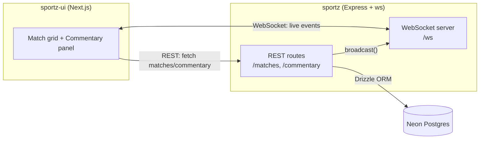

## What Sportz is

Sportz is a **real-time match broadcast platform**. It ingests live match data — scores and ball-by-ball commentary — and delivers it to connected clients with sub-second latency over WebSockets. A football goal, a cricket wicket, a basketball three-pointer: the moment it's recorded via the API, every subscribed client sees it without refreshing.

It is two deployed applications plus a managed database:

- **`sportz`** — the backend API: Express + WebSocket server, Drizzle ORM over Neon Postgres, protected by Arcjet.
- **`sportz-ui`** — the frontend: Next.js (App Router) client app with React Query, Framer Motion, and a yellow-forward design system.
- **Neon** — serverless Postgres, with ephemeral branches for local dev and a pooled connection in production.

<Note>
This handbook documents the system **as it actually exists today**. Where a capability is planned but not yet built, it is marked explicitly — see [Project Status](/project-status) for the honest scope boundary. Nothing here is aspirational unless it says so.
</Note>

## Goals

| Dimension | Goal |
|---|---|
| **Product** | Let a viewer follow a live match — scores + commentary — updating in real time, across football, cricket, and basketball. |
| **Technical** | Single HTTP server hosting both REST and WebSocket; type-safe end to end; deployable as one container. |
| **Operational** | Reproducible local dev (Docker + Neon Local), automated tests in CI, one-command deploy. |
| **Quality** | Every architectural choice is recorded with its tradeoffs (see [Decisions](/decisions)); every production bug is post-mortemed (see [Issues](/issues)). |

## High-level architecture

When a match or commentary event is created via REST, the route writes it to Postgres and then calls a broadcast function that pushes it out over the WebSocket layer — so the client that's watching sees it instantly, and so does every other connected client.

## Platform capabilities matrix

| Capability | Status | Where it's documented |
|---|---|---|
| REST API (matches, commentary) | ✅ Built | [Backend](/architecture/backend), [API Reference](/reference/api) |
| WebSocket live broadcast | ✅ Built | [Real-Time Deep Dive](/architecture/realtime) |
| Match status derivation (scheduled/live/finished) | ✅ Built | [Backend](/architecture/backend) |
| Input validation (Zod) | ✅ Built | [Security](/operations/security) |
| Rate limiting + bot protection (Arcjet) | ✅ Built | [Security](/operations/security) |
| Backend tests (Vitest, 95 tests) | ✅ Built | [Testing](/operations/testing) |
| Frontend E2E + a11y (Playwright) | ✅ Built | [Testing](/operations/testing) |
| Deployed smoke test (live stack) | ✅ Built | [Testing](/operations/testing) |
| CI/CD — backend (Actions) + frontend (Actions + Vercel) | ✅ Built | [DevOps](/operations/devops) |
| Branch protection (CI gates production) | ✅ Built | [DevOps](/operations/devops) |
| Containerized deploy (backend → Render, frontend → Vercel) | ✅ Built | [DevOps](/operations/devops) |
| Frontend observability (Sentry, PostHog, New Relic) | 🟡 Wired, keys pending | [Observability](/operations/observability) |
| Backend observability (APM, OpenTelemetry) | ❌ Not built | [Observability](/operations/observability) |
| Authentication / authorization | ❌ Not built | [Project Status](/project-status) |
| Caching layer (Redis) / queues | ❌ Not built | [Project Status](/project-status) |

## How to read this handbook

<CardGroup cols={2}>
  <Card title="New to the project?" icon="play" href="/architecture/system">
    Start with System Architecture for the C4 view, then Frontend and Backend.
  </Card>
  <Card title="Want the 'why'?" icon="scale-balanced" href="/decisions">
    Decisions records every major choice with alternatives and tradeoffs.
  </Card>
  <Card title="Debugging something?" icon="bug" href="/issues">
    The Engineering Log post-mortems every real production bug we hit.
  </Card>
  <Card title="Operating it?" icon="gears" href="/operations/devops">
    DevOps, Testing, Observability, and Security cover running it.
  </Card>
</CardGroup>
