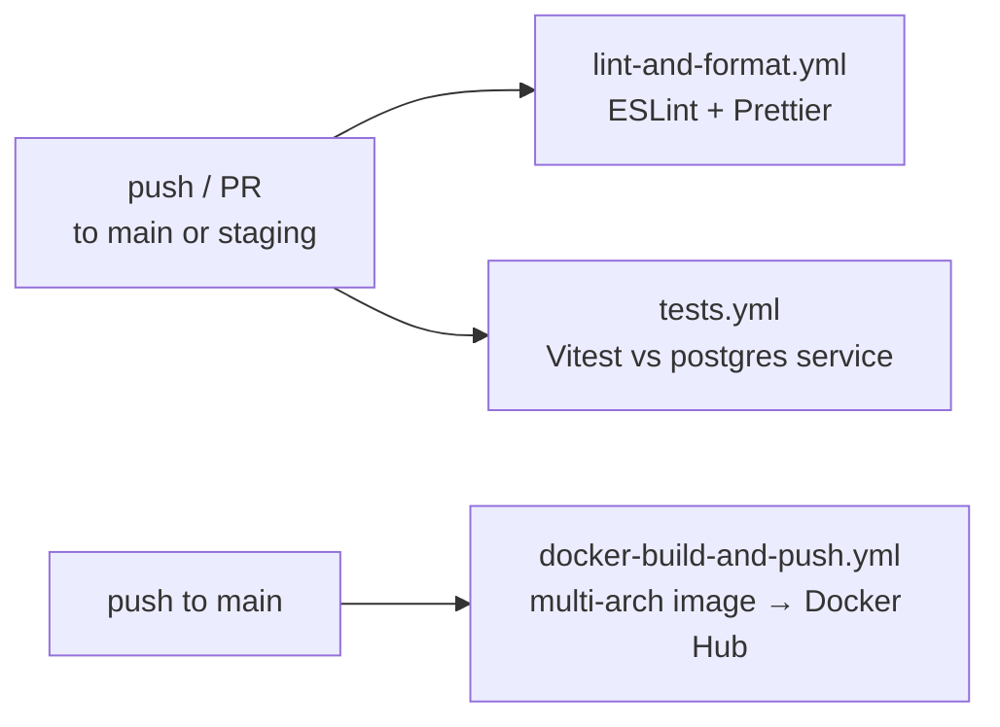

## Environments

| Environment | Database | How it runs |
|---|---|---|
| **Local (direct)** | plain Postgres or Neon Local | `npm run dev` (tsx watch) |
| **Local (Docker)** | Neon Local (ephemeral branch) | `npm run dev:docker` → `docker-compose.dev.yml` |
| **Test / CI** | `postgres:16-alpine` container | `npm test` |
| **Production** | Neon Cloud (pooled) | Docker image on Render |

## The Docker image

A **multi-stage** build (full detail in [Backend](/architecture/backend)):

- **`builder`** — installs all deps, compiles TypeScript → `dist/`.
- **`runner`** — fresh image, production deps only, copies just `dist/`, runs as a non-root user.

The final image ships no compiler, no devDeps, no source — smaller and lower attack surface. Both compose files target the `runner` stage (a mismatch here was a real bug — [Issues](/issues)).

## Local dev with Neon Local

`docker-compose.dev.yml` runs the app plus a **Neon Local** proxy that forks a fresh ephemeral Neon branch on `up` and deletes it on `down`. `scripts/dev.sh` (via `npm run dev:docker`) validates env, waits for the proxy to be healthy, runs migrations, then tails logs.

```bash
npm run dev:docker                              # start the dev stack
docker compose -f docker-compose.dev.yml down   # stop + delete ephemeral branch
```

<Tip>
This project has **two** compose files and no default `docker-compose.yml`, so the `-f` flag is always required. A handy alias: `alias dc-dev='docker compose -f docker-compose.dev.yml'`.
</Tip>

## CI/CD — three GitHub Actions workflows



1. **`lint-and-format.yml`** — runs ESLint and Prettier; reports *both* failures together (not one-at-a-time) with fix commands as annotations.
2. **`tests.yml`** — spins up a `postgres:16-alpine` service container, runs migrations, runs `npm test`, uploads coverage (30-day retention), writes a summary.
3. **`docker-build-and-push.yml`** — on merge to main (or manual), builds `linux/amd64` + `linux/arm64`, tags (branch, SHA, `latest`, `prod-YYYYMMDD-HHmmss`), pushes to Docker Hub. Requires `DOCKER_USERNAME` / `DOCKER_PASSWORD` repo secrets.

## Deploy to Render

Production deploys via a **Render Blueprint** (`render.yaml`) using Render's **Docker runtime** — Render builds the same Dockerfile you tested locally.

```yaml
services:
  - type: web
    name: sportz-api
    runtime: docker
    dockerfilePath: ./Dockerfile
    healthCheckPath: /        # GET / is registered BEFORE Arcjet — never rate-limited
    envVars:
      - { key: DATABASE_URL, sync: false }   # Neon Cloud pooled URL, set in dashboard
      - { key: ARCJET_KEY,   sync: false }
      - { key: CORS_ORIGIN,  sync: false }
      - { key: NODE_ENV, value: production }
      - { key: PORT,     value: "8000" }
      - { key: HOST,     value: "0.0.0.0" }  # bind all interfaces so Render can route in
```

**Migrations are not automatic** — Render runs the app, not migrations. Run once against the prod DB before/after first deploy:

```bash
DATABASE_URL="<neon-cloud-pooled-url>" npm run db:migrate
```

### The flow, end to end

```
laptop → git push → PR → CI (lint + tests) → review → merge to main
   → docker-build-and-push (image) + Render auto-deploy from main → production
```

## Not yet built

- **Staging environment** — the workflows trigger on `staging` branch, but no staging deploy target is wired.
- **Rollback automation** — Render keeps prior deploys (manual rollback in dashboard); no scripted rollback.
- **Graceful shutdown** on deploy — SIGTERM currently drops WS connections uncleanly (`close()` exists as the building block; see [Backend](/architecture/backend)).
