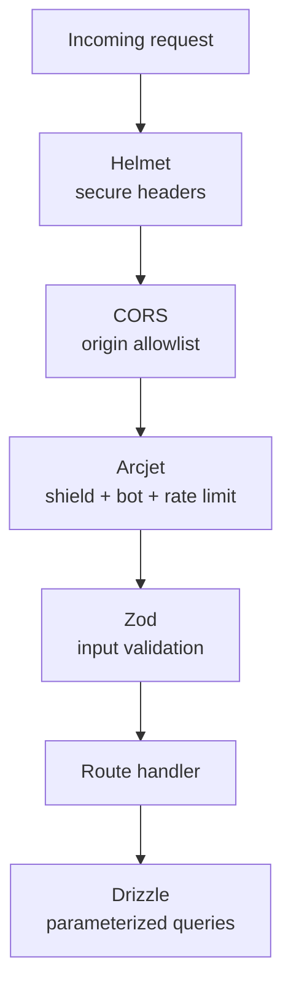

Security documented here is **what exists**. Sportz has no authentication, so this page covers the layers that *are* built — input validation, rate limiting, headers, secrets, transport — and is explicit about what isn't.

## Defense layers (what's built)

## Input validation — Zod

Every request body and query is parsed with a Zod schema before any logic runs. Invalid input returns `400` with structured issue details and never reaches the database. This also closes the door on a class of injection by rejecting malformed shapes early. See the validation schemas in [Backend](/architecture/backend).

## SQL injection — Drizzle parameterization

All queries go through Drizzle ORM, which uses parameterized queries — user input is never string-concatenated into SQL. The one place raw SQL appears (`TRUNCATE` in the test reset helper) takes no user input.

## Rate limiting & bots — Arcjet

Arcjet runs on both the HTTP path and the WebSocket upgrade:

- **Shield** — common attack patterns.
- **Bot detection** — blocks automated traffic (allows search engines / previews).
- **Sliding window** — 50 req/10s on HTTP; 5 connections/2s on WS upgrades.

A denied request gets `429` (rate limit) or `403` (other). If Arcjet itself errors, the HTTP path **fails closed** (`503`). Arcjet is mocked in tests so the suite is fast and offline (see [Testing](/operations/testing)).

## Secure headers — Helmet

`helmet()` sets a baseline of secure response headers (HSTS, no-sniff, frame options, etc.) on every Express response.

## Transport security — TLS

Production talks to Neon Cloud over verified TLS (`rejectUnauthorized: true`). The three-way SSL strategy (Cloud verified / Local self-signed / plain-Postgres off) is in [Backend](/architecture/backend) and was the subject of a real bug ([Issues](/issues)).

## Secrets & environment variables

- Secrets (`DATABASE_URL`, `ARCJET_KEY`) are **never committed** — `.env*` is gitignored; only `.env.*.example` templates are tracked.
- In production they're injected via Render dashboard (`sync: false` in `render.yaml`), not baked into the image.
- In CI they're GitHub Actions secrets.

## Dependency security

`npm audit` surfaces known vulnerabilities; CI installs with `npm ci` for reproducible, lockfile-pinned installs.

## Honest gaps (not built)

| Area | Status | Note |
|---|---|---|
| **Authentication** | ❌ None | No user accounts. The API is open. |
| **Authorization** | ❌ None | Follows from no auth — no roles or protected resources. |
| **CSRF** | ➖ N/A today | No cookie-based auth / state-changing browser forms with ambient credentials, so the classic CSRF vector doesn't apply. Becomes relevant the moment auth + cookies are added. |
| **XSS** | 🟡 Partial | React escapes rendered content by default; no `dangerouslySetInnerHTML` in use. A formal CSP (`Content-Security-Policy`) header is **not** yet configured — a recommended hardening step. |
| **Secrets rotation** | ❌ Manual | No automated rotation. |

<Warning>
The biggest security caveat: **there is no auth.** Anyone who can reach the API can create matches and commentary. That is acceptable for a demo/portfolio platform but would be the first thing to add before any real multi-user deployment.
</Warning>
